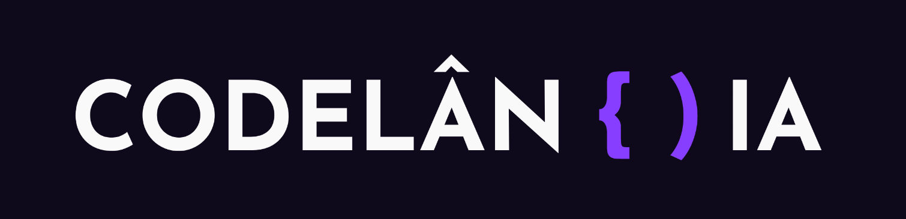

# CODELÂNDIA

# Projetos para prática de Front-end com as mais diversas tecnologias.

  
  
  
  
  
  
  
  
  
  
  

   

## Desafios

## Desafio 01

  

    Lorem ipsum dollor amet.  
  

     
