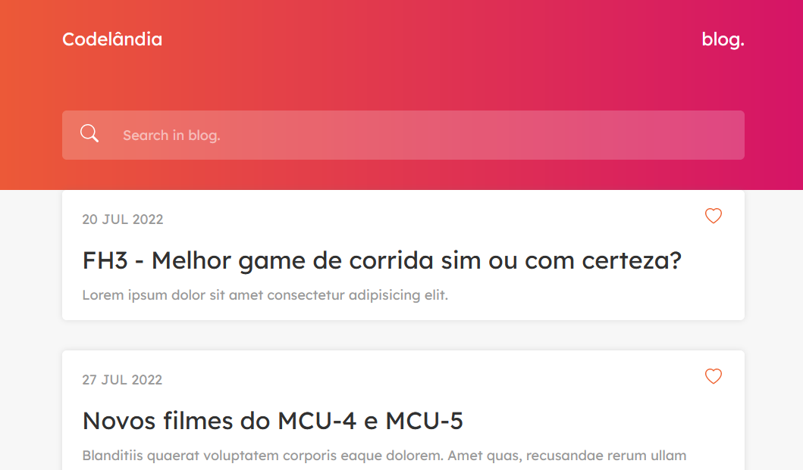

<div align="center">
  

  ### blog.
  
  <p>Projects by group codelândia.</p>
  
   &nbsp;
   &nbsp;
   &nbsp;
   &nbsp;
  
</div>


<div>

## <b>Overview</b>

Projeto de desafio do grupo <b>Codelândia</b>, onde devemos codificar as landing pages disponibilizadas.<br>
Objetivo do projeto foi criar uma página responsiva para um blog fictício, desenvolvida com as technologias:<br />
<b>HTML5</b> | <b>CSS3</b> | <b>JavaScript</b> | <b>SASS</b> | <b>React</b> | <b>Json-Server</b> e métodologia <b>BEM</b>.
<br><br><br>
</div>


<div>

  ## Features
  
  - AOS JS
  - Fetch API
  - Json-Server
  - Fully responsive
  - SEO optimized
  - W3C validation
  - Pages load speed
  - Page Home
  - Page About
  - Page Post details
  - Smooth animation on scroll
</div>


<div>

## <b>Screenshots</b>


<p>

_blog. - SASS / BEM_</p>

</div>


<div>

  ## That I liked to learn
  
  <p>Doing use library <b>AOS JS</b>.</p>

  ```CSS
  <div data-aos="fade-up"> ... </div>
  ```
  
  <br />
  
  <p>Doing <b>fetch</b> datas in JavaScript</p>
  
  ```javascript
  featch('db.json').then(response => response.json())...
  ```
</div>
<br />


<div>

## <b>See project online</b>
  <a href="https://www.realles.tk/projects/hora-de-codar/project04/" target="_blank"></a>
</div>


<div>
  
  ## Thanks
  
  <p>Thanks _Iuri Silva_ disponibilized layouts Figma in group codelândia.</p>
</div>


<footer>
  <p>Gostou? deixa seu like!</p>
  <p>Estou disponível para realizar seus projetos</p>
  <a href="mailto:diogorealles@hotmail.com"></a>
  <a href="https://www.linkedin.com/in/diogorealles/"></a><br />
  
  <p><strong>Diogo Realles | 2022</strong></p>
</footer>
